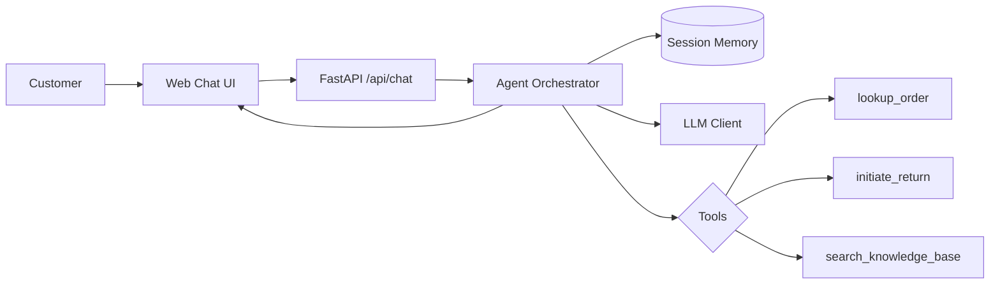

# Bookly Support Agent — Solution Pitch Deck

> Export tip: paste each slide section into Google Slides, Keynote, or Marp.

---

## Slide 1 — Thesis

### Grounded, conversational support beats "magic" autoreply

**Core belief:** A great CX agent should feel human in *conversation* but behave like software in *execution* — never guessing order status, refund eligibility, or policy details.

**How the prototype reflects this:**

| Principle | Implementation |
|-----------|----------------|
| Ask before acting | Required slots (order ID, email, reason) collected across turns before any tool runs |
| Facts from tools, tone from LLM | Order/return data always comes from mocked APIs; LLM only classifies intent and phrases the reply |
| Narrow scope, real depth | Two transactional flows (order status + returns) plus FAQ — not 10 shallow intents |

**Trade-off accepted:** More turns for transactional requests vs. single-shot answers. Worth it because wrong order info destroys trust faster than an extra question.

---

## Slide 2 — Architecture

### Inquiry flow through the system

**Key components:**

1. **Orchestration** — Explicit state machine: `classify → collect_slots → execute_tool → respond`. Not an open-ended agent loop.
2. **Tools** — Python functions backed by `mock_db.json`. Same interface you'd swap for Shopify/Salesforce in production.
3. **Memory** — Per-session intent, filled slots, and pending slot queue enable multi-turn flows without re-asking.
4. **Prompts** — Separate system prompt, intent classification, slot extraction, and response generation prompts.

---

## Slide 3 — Key Decision #1: Gated Tool Use

**Choice:** Tools only run after all required slots are collected and validated.

**Alternatives considered:**
- *ReAct / function-calling loop* — LLM decides when to call tools freely
- *Single-shot extraction* — ask for everything upfront in one message

**Trade-offs:**

| Gated (chosen) | Free function-calling |
|----------------|----------------------|
| ✅ Prevents hallucinated lookups | ❌ Model may call tools with partial/wrong args |
| ✅ Predictable, debuggable flows | ❌ Harder to test and explain to stakeholders |
| ❌ Extra conversational turns | ✅ Feels "smarter" when it works |

**Why worth it:** In support, a confident wrong answer is worse than a clarifying question. Gating trades latency for correctness.

---

## Slide 4 — Key Decision #2: Mock-First, LLM-Optional

**Choice:** Deterministic mock NLU + template fallbacks; OpenAI enhances phrasing when `OPENAI_API_KEY` is set.

**Trade-offs:**
- Demo works offline with zero setup — important for interview review
- Mock regex classifier is brittle on paraphrase; live LLM fixes that
- Templates guarantee tool facts aren't rewritten incorrectly

**Also: intent disambiguation**
- When classification returns `unclear`, agent asks a structured clarifying question instead of guessing
- Example: *"Are you checking order status, starting a return, or asking a general question?"*

---

## Slide 5 — What I'd Do Differently (Production)

**First change: add a retrieval + verification layer for FAQs and policies**

Today, FAQ answers come from a static keyword map. In production I'd:

1. **Index policies in a vector store** with source citations
2. **Require the LLM to cite retrieved chunks** before answering policy questions
3. **Add human handoff tool** when confidence is low or sentiment is negative
4. **Persist sessions to Redis/Postgres** and connect tools to real OMS (order management) APIs
5. **Add eval harness** — golden conversations for order/return flows with regression tests on tool args

**Why this first:** Transactional flows are already grounded; the highest hallucination risk in support is policy/general answers at scale. RAG + citation fixes that without sacrificing the orchestration model.

---

## Appendix — Demo highlights for recording

1. **Multi-turn:** "Where is my order?" → BK-10042 → alex@example.com → shipped status with tracking
2. **Tool action:** Return flow creates `RET-XXXXXXXX` and persists to mock DB
3. **Clarifying question:** "I need help" → disambiguation prompt
4. **Immediate FAQ:** "What's your shipping policy?" → knowledge base, no slot collection
